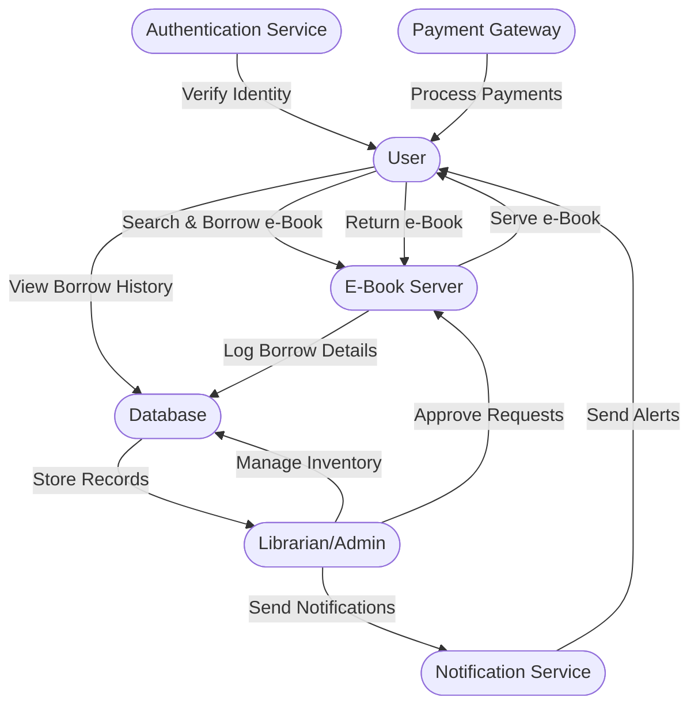
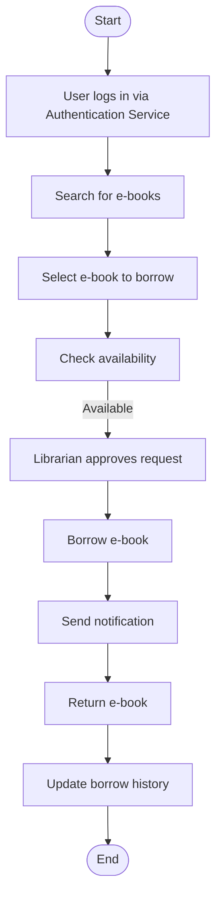
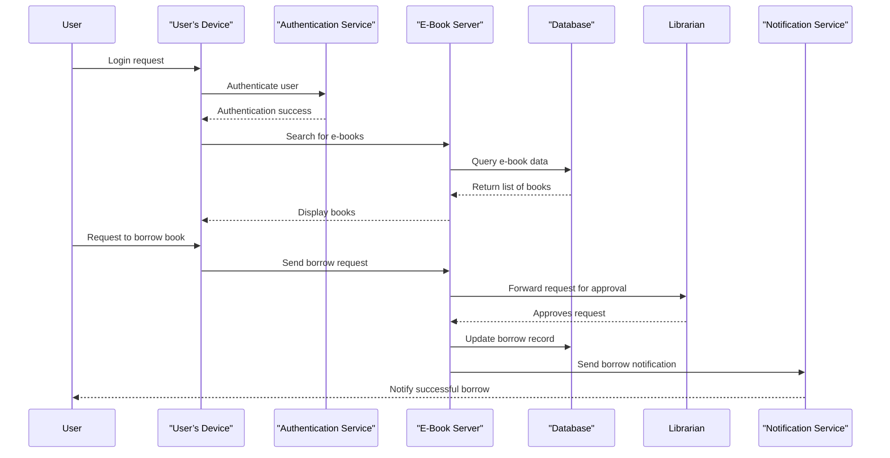

#  **Actors for E-Book Borrowing System**

### **Primary Actors**

* **User (Student/Reader)** → Borrows, returns, and searches for e-books.
* **Librarian/Admin** → Manages e-book inventory, approves borrow requests, and maintains the system.
* **E-Book Server** → Hosts the e-books and provides access to users.
* **Authentication Service** → Verifies user identity for secure borrowing and returning.

### **Secondary Actors**

* **Database** → Stores user data, borrow history, and e-book details.
* **Notification Service** → Sends alerts for due dates, new arrivals, etc.
* **Payment Gateway (Optional)** → Handles payments for late fees or subscriptions.
* **User’s Device (Browser/Mobile App)** → Interface through which users interact with the system.

---

#  **UML Use Case Diagram**

---

#  **UML Activity Diagram (User Flow + Borrowing Process)**

---

#  **UML Sequence Diagram (Borrowing Process)**

---

